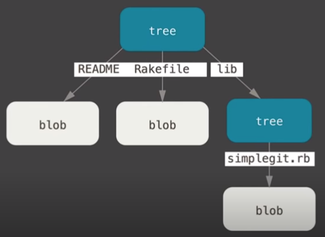
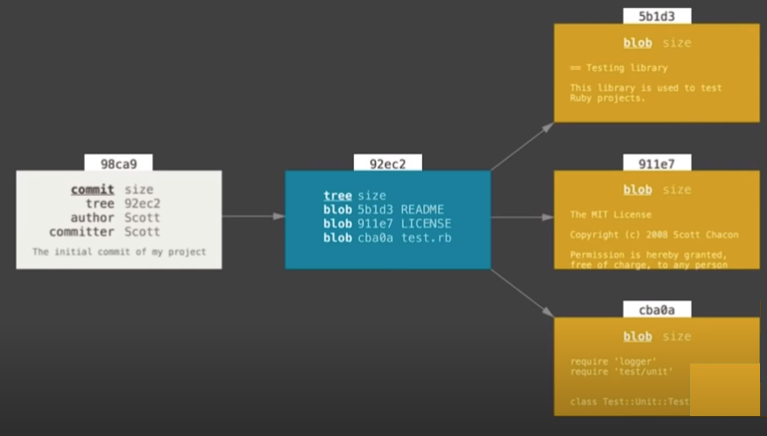
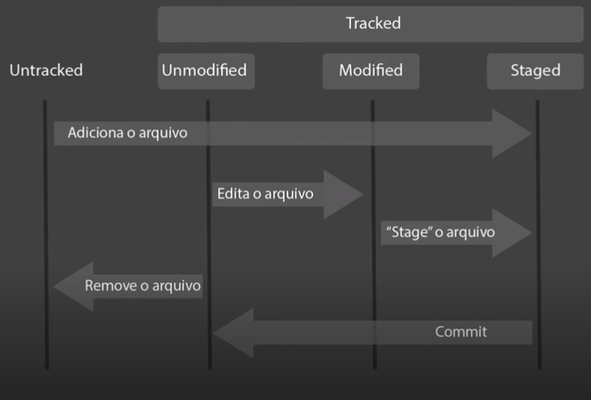

# Introdução ao Git e ao Github

Digital Innovation One
Otávio Reis
URL: https://web.dio.me/course/introducao-ao-git-e-ao-github/learning/75b9fe49-6ed4-4480-83a7-7e37fc356aa9?back=/track/linux-experience&tab=undefined&moduleId=undefined

## Git

- Git é um sistema de versionamento de código distribuído (VCS - Version Control System)
- Foi criado em 2005 pelo Linus Torvalds para gerir os pacotes do Kernel do Linux de forma colaborativa
- Ele veio do descontentamento do Linus com outro sistema de versionamento, o CVS (Concurrent Version System)
- Git é diferente de GitHub
- É um CLI - Command Line Interface
- Benefício de aprender as duas tecnologias juntas:
  - Controle de Versão
  - Armazenamento em nuvem
  - Trabalho em equipe
  - Melhorar seu código
  - Reconhecimento

## Comandos básicos do Terminal

- Terminal do Windows é derivado do Shell, terminal do Linux é derivado do Bash
- Silence on Sucess: se der tudo certo o terminal não vai exibir nenhuma mensagem
- Windows
  - Listar pastas e arquivos: `dir`
  - Navegar entre pastas (no exemplo leva para a base do C:): `cd /`
  - Retroceder um nível na navegação: `cd ..`
  - Limpar o terminal: `cls`
  - Autocompletar: TAB
  - Criar pasta: `mkdir workspace`
  - Acessar pasta: `cd workspace`
  - Imprimir mensagem no terminal: `echo hello`
  - Criar conteúdo em um arquivo (> é um redirecionador de fluxo): `echo hello > hello.txt`
  - Apagar todos os arquivos dentro de uma pasta (mas não a pasta): `del workspace`
  - Apagar pasta e conteúdo: `rmdir workspace /S /Q`
  - Mover para uma pasta dentro de outra: `mv arquivo.ext ./pasta`
- Linux (no vídeo ele usa o Windows Subsystem for Linux)
  - Listar pastas e arquivos: `ls`
  - Navegar entre pastas (no exemplo leva para a raiz do sistema): `cd /`
  - Retroceder um nível na navegação: `cd ..`
  - Limpar o terminal: `clear` ou CTRL + L
  - Autocompletar: TAB
  - Pegar permissão de root: `sudo su`
  - Criar pasta: `mkdir workspace`
  - Acessar pasta: `cd workspace`
  - Criar conteúdo em um arquivo (> é um redirecionador de fluxo): `echo hello > hello.txt`
  - Apagar pasta e conteúdo (r = recursivo, f = force, não aparecer nenhuma confirmação): `rm -rf workspace`

## Instalando o Git

- Site: https://git-scm.com/
- Fazer a instalação no Windos com o instalador
  - Ter certeza que estas duas opções estão marcadas: Git Bash Here e Git GUI Here
- A branch principal era chamada de master mas isso foi alterado para main (pode-se escolher na instalação do Git entre os dois, mas é interessante deixar o main)
- a partir da versão 2.30 o Git passou a usar o Git Credential Manager Core no lugar do Git Credential Manager, que está defasado
- Para Linux e MacOS seguir as instruções no site para a distriuição que está sendo usada, usando o gerenciador de pacotes (no MAC a recomendação é o Homebrew)
- No Windows abrir o Git Bash ou na pasta usar o atalho Git Bash Here

## Tópicos fundamentais para entender o funcionamento do Git

### SHA1

- significa Secure Hash Algorithm (Algoritmo de Hash Seguro), é um conjunto de funções hash criptográficas projetadas pela NSA
- um algoritmo de encriptação
- a encriptação gera um conjunto de caracteres identificadores com 40 digitos únicos e serve como identiicação
- de forma resumida é uma forma curta de representar uma arquivo
- `echo "ola mundo" | openssl sha1`
  `>(stdin)= d9802fa01c4c1dfc4ddaf61f766d8d56ad8a8699`
- ou `openssl texto.txt`

### Objetos Fundamentais

- Blobs

  - Bloco básico de composição

  - --stdin: usar quando a função espera receber um arquivo e estou usando como entrada um arquivo texto

  - Retorna o SHA1 de conteudo: `echo "conteudo" | git hash-object --stdin`

  - o resultado do comando acima é diferente do gerado pelo OpenSSL, porque o Git manipula e armazena o conteúdo através de objetos

  - são armazenados em um objeto Blob (estrutura básica abaixo, com os metadados):

    `Blob <tamanho>`

    `\0`

    `Ola Mundo`

  - Para ficar igual, preciso passar os metadados do Blob:

    `echo -e 'blob 9\0conteudo' | openssl sha1`

  - encapsula o comportamento de diretórios e é usado para apontar para eles, apontando para arquivos

- Trees

  - Armazenam e apontam para Blobs

  - Estrutura básica abaixo, com os metadados):

    `Tree <tamanho>`

    `\0`

    `blob sa4d8s texto.txt`

  - Guarda o sha e o nome do arquivo, ao contrário do Blob

  - é recursivo, emulando a estrutura de diretórios

  - as árvores também tem um SHA1 desse metadado

  - se o SHA1 de um arquivo, ele muda o SHA1 do Blob, e também muda o SHA1 da Tree 

  - Estrutura de objetos no Git (Blobs e Trees):

    

- Commit

  - Aponta para todo os outros objetos

  - o SHA1 desse commit é o hash de toda a informação

  - Estrutura básica abaixo, com os metadados):

    `Commit <tamanho>`

    `tree s4a5sq1`
    `parente a98aq1` -- o último commit realizado antes dele

    `autor perkles`

    `mensagem "inicia..."`

    `timestamp`

  - Estrutura de objetos no Git (Commit, Tree e Blob):

    

### Sistema Distribuído Seguro

- o código que está armazenado é o estado final do código, que ajuda no trabalho distribuído, pois os commits são difićeis de serem alterados
- então a versão mais recente e confiável vai estar em todos as pastas de todos os contribuidores

### Chave SSH e Token

Chave SSH

- é uma forma de estabelecer uma conexãos segura e encriptada entre duas máquinas, que estabelece a máquina local como segura para o github
- chave pública (cliente)
- chave privada (servidor)
- Para criar a chave no Github:
  - Primeiro ir no CLI (Gitbash, cria na pasta .ssh por padrão, ed25519 - tipo de criptografia da chave): `ssh-keygen -t ed25519 -c email@email.com`
  - Executar na pasta .ssh: `cat id_ed25519.pub`
  - Depois ir no Github no 1Perfil > Settings > SSH and GPG Keys > New SSH Key e colar o conteúdo do último comando no campo Key (o nome/alias é aberto)
  - Voltar para o CLI e inicializar o SSH Agent: `eval $(ssh-agent -s)`
  - Entregar a chave para o Agent (passar a chave privada, não a pública): `ssh-add id_ed255519`
- Quando for usar o clone usar sempre o SSH e não o HTTPS: `git clone caminho_ssh`
- Para criar uma acesso por token, ir em Developer Settings > Personal Access Tpkens > New...
  - Configurar data de expiração ou desativar
  - Escolher um Aluas
  - marcar a opção repo
  - Generate Token
  - Copiar o token e salvar em um arquivo seguro
  - Escolher a conexão HTTPS para usar usar o token quando clonar um repositório, usando o token como senha

## Primeiros comandos com o Git

- Criar a pasta com o repositório

- Iniciar um repositório Git (cria uma pasta oculta gerencial do git - .git - ver ls -a)

  - `git init`

  - se for a primeira vez que ele está sendo usado, é necessário fazer algumas configurações:

    `git config --global user.email "email@email.com"`

    e

    `git config --global user.name Algum_Nome_Curto`

- Iniciar o versionamento de código

  - `git add *`

- Criar um commit

  - `git commit -m "Um texto descritivo do commit"`

- o número exibido  após o root-commit são os primeiros caracteres do SHA1

## Ciclo de vida dos arquivos no Git

- GIT INIT: inicializa o repositótio no Git

- Tracked e Untracked pelo Git

  

  - Untracked (arquivo acabou de ser criado) são os arquivos que o Git ainda não tem ciência deles e Tracked o Git tem ciência
  - Unmodifeid (depois do Commit): arquivo ainda não modificado
  - Modified: arquivo modificado
  - Staged (depois do git add): conceito chave; arquivos que estão se preparando para fazer outro tipo de agrupamento

- Repositórios

  - Servidor

    - Remote Repository (GitHub)

  - Ambiente de Desenvolvimento

    - Working Directory > Staging Area > Local Repository

    

- Monitorar os status dos arquivos: `git status`

- Adicionar vários arquivos: `git add arquivo.ext pasta/`

- Adiciona todas modificações para a stagiing area: `git add *` ou `git add .`

## Trabalhando com o GitHub

- Objetivo: Apontar o repositório da máquina para o repositório remoto
- Seus repositorios > Novo
- Incluir repository Name (sem espaços)
- Adicionar descrição
- Definir Público ou Provado
- Marcar inicializar repositório com o Readme
- Clicar em Criar Repositório
- Apontar para o repositório local (pasta)
- Na pasta: `git remote add origin https://link-do-github` (por convenção usamos origin, mas pode ser qualquer coisa)
- Listar os repositórios remotos: `git remote -v`
- Subir arquivos no github: `git push origin master`

# Criando seu primeiro repositório no GitHub

Venilton FalvoJr
Tech Lead, Digital Innovation One

Reforce seu conhecimento em Git com um desafio de projeto totalmente prático, onde você executará todos os passos para a criação, atualização e sincronização de um repositório no GitHub. 

- Passos:

  - Criar repositório no GitHub

  - Acessar a pasta local com o Gitbash

  - Usar: `git clone link-do-github`
  - Para verificar alterações: `git status`
  - Adicionar todas as alterações: `git add .` ou `git add -A`
  - Depois: `git commit -m "comentário coerente com o envio"`
  - Enviar todos os commits locais para a nuvem: `git push origin main`

